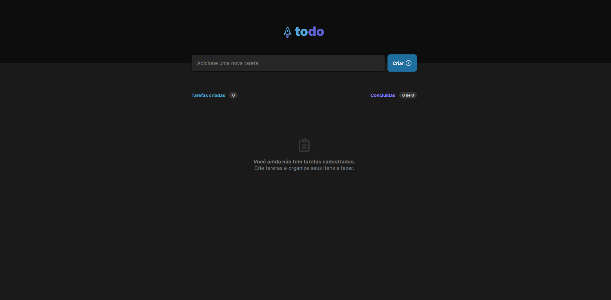

<a href="">Clique aqui para ter acesso a este projeto!<a>

<h1>TodoList</h1>

<h3>REACT + TypeScript</h3>

ste projeto é um TodoList desenvolvido durante o curso Ignite da RocketSeat. Nele, foram aplicados diversos conceitos fundamentais do React, como:

Utilização de Props para passar dados entre componentes.

Gerenciamento de eventos com o useState().

Prevenção do comportamento padrão de formulários com preventDefault().

Iteração de arrays com o método map.

Geração de IDs únicos utilizando a biblioteca UUID.

Filtragem de tarefas concluídas e não concluídas com o método filter.

Manipulação de elementos de input e eventos de mudança (ChangeEvent).

Gerenciamento de submissão de formulários com handleSubmit.

Implementação de estruturas condicionais e operadores ternários.

Manipulação de eventos de clique com onClick.

Uso de arrow functions.

Aplicação de CSS Modules para garantir classes únicas (import styles from '...').

Embora um TodoList seja uma aplicação simples, este projeto me proporcionou um aprendizado significativo ao trabalhar a lógica por trás de cada funcionalidade. Foi uma excelente oportunidade para consolidar conhecimentos e práticas essenciais no desenvolvimento com React.

Este projeto também está responsivo para telas menores e dispositivos móveis.

<h1>ING</h1>

This project is a TodoList developed during RocketSeat's Ignite course. In it, several fundamental React concepts were applied, such as:

Using Props to pass data between components.

Event management with useState().

Preventing default form behavior with preventDefault().

Iterating arrays with the map method.

Generation of unique IDs using the UUID library.

Filtering completed and uncompleted tasks with the filter method.

Manipulation of input elements and change events (ChangeEvent).

Form submission management with handleSubmit.

Implementation of conditional structures and ternary operators.

Handling click events with onClick.

Use of arrow functions.

Application of CSS Modules to guarantee unique classes (import styles from '...').

Although a TodoList is a simple application, this project provided me with significant learning by working on the logic behind each functionality. It was an excellent opportunity to consolidate essential knowledge and practices in development with React.

This project is also responsive for smaller screens and mobile devices.
